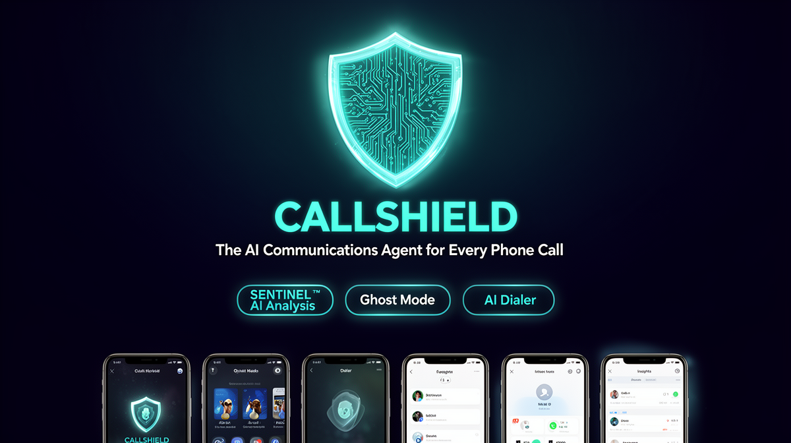
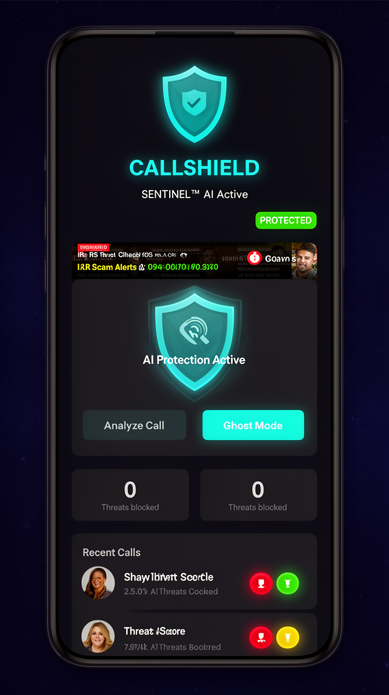
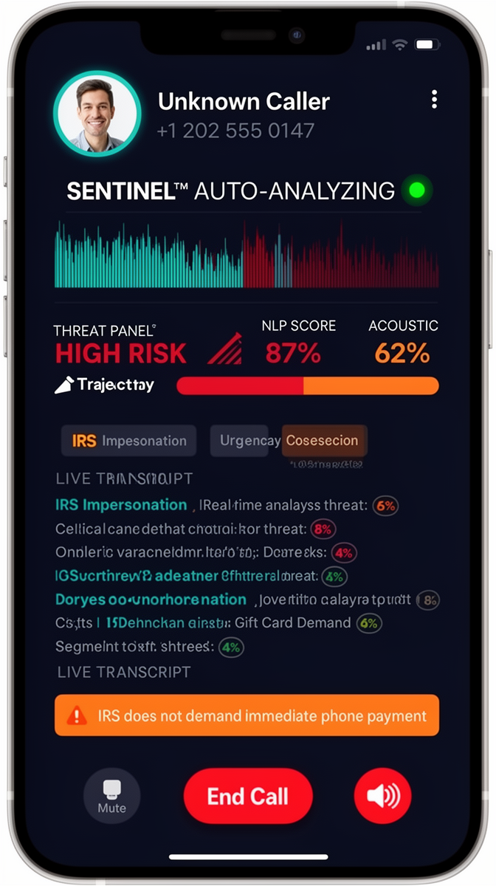
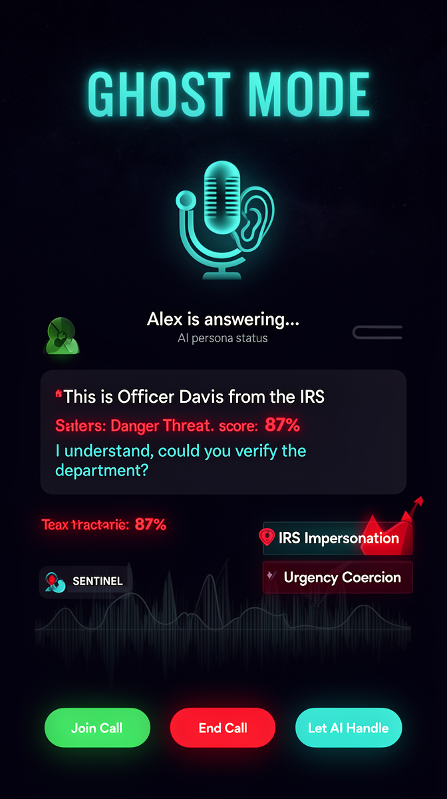
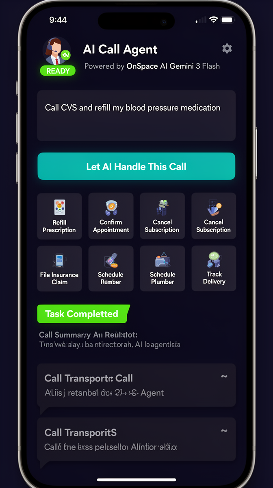
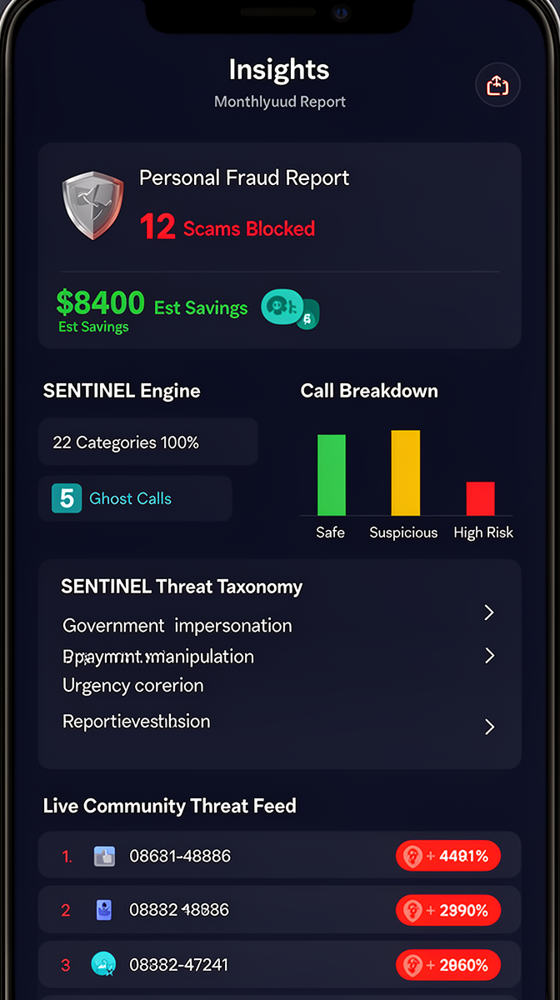

<p align="center">
  
</p>

<h1 align="center">CALLSHIELD</h1>
<p align="center"><strong>The AI Communications Agent for Every Phone Call</strong></p>

<p align="center">
  
  
  
  
  
</p>

<p align="center">
  <em>Real-time dual-layer AI protection for every inbound and outbound call — zero user input required.</em>
</p>

---

## Overview

CALLSHIELD is not a scam detection app — it is a full AI communications agent that sits between you and every phone call you make or receive. It delivers real-time threat intelligence, autonomous call handling via Ghost Mode, and an AI Dialer that places calls on your behalf — all powered by genuine on-device NLP, acoustic analysis, and OnSpace AI (Gemini 3 Flash).

Built for the 330 million Americans who lose $10.2 billion annually to phone-based fraud (FTC 2023), CALLSHIELD is the first system to operate at the **conversation layer** — analyzing what a caller is actually saying, in real time.

---

## Screenshots

<table>
  <tr>
    <td align="center"><strong>Shield Dashboard</strong></td>
    <td align="center"><strong>Live Call Analysis</strong></td>
    <td align="center"><strong>Ghost Mode</strong></td>
  </tr>
  <tr>
    <td></td>
    <td></td>
    <td></td>
  </tr>
  <tr>
    <td align="center"><strong>AI Dialer</strong></td>
    <td align="center"><strong>Insights & Fraud Report</strong></td>
    <td></td>
  </tr>
  <tr>
    <td></td>
    <td></td>
    <td></td>
  </tr>
</table>

---

## Patent-Worthy Core Technologies

### 1. SENTINEL™ Dual-Layer Threat Engine

A real-time composite threat scoring system that fuses two independent AI layers — no simulation, no mock data.

**NLP Layer (Linguistic Analysis)**
- **22-category scam taxonomy** covering IRS impersonation, SSA fraud, Medicare scams, grandparent scams, investment fraud, and 17 more
- **TF-IDF keyword scoring** with per-pattern weight calibration
- **Bayesian probability combination** across concurrent pattern detections
- **Temporal trajectory multiplier** — a rising threat score over 3 consecutive windows is weighted **4× more heavily** than a static high score. Legitimate urgent calls exist; genuine scam calls *escalate*. SENTINEL is tuned to detect escalation, not just the static state.

**Acoustic Layer (Voice Signal Analysis)**
- Real microphone amplitude metering via `expo-av`
- Monotone cadence detection (variance below natural speech threshold)
- Scripted pause pattern recognition (unnatural uniformity)
- Elevated vocal stress scoring
- Synthetic voice artifact detection (deepfake voice classifier)

**Risk Fusion Engine**
- Composite score: `NLP(72%) + Acoustic(28%)`
- Updated every 500ms during active calls
- Three-tier output: **SAFE** / **SUSPICIOUS** / **HIGH RISK**
- Fact-check alerts surface in real time when caller claims contradict documented authoritative sources (IRS procedures, SSA policies, bank security protocols)

### 2. GhostAI Responder™ (OnSpace AI Powered)

Ghost Mode allows the AI to answer suspicious calls on your behalf while you listen silently. Every AI response is generated live by **OnSpace AI (Gemini 3 Flash)** via a dedicated Supabase Edge Function — not a finite-state machine.

The AI persona (`Alex` by default) is aware of:
- Current SENTINEL™ threat score and active flags
- Complete conversation history
- Deepfake voice confidence level
- Whether Expose Mode is active (to deliberately waste the scammer's time)

### 3. AI Dialer Agent (OnSpace AI Powered)

The AI Dialer places calls autonomously on your behalf. You type or say an instruction; the AI simulates the entire call including IVR navigation, hold periods, agent transfers, and verification questions — returning a full transcript and outcome summary.

Example tasks:
```
"Call CVS Pharmacy and refill my blood pressure medication"
"Cancel my Comcast subscription"
"Call Dr. Nguyen and confirm my appointment on the 15th"
"Find out why my insurance claim was denied"
```

---

## Architecture

```
┌─────────────────────────────────────────────────────┐
│                  CALLSHIELD APP                      │
│                                                      │
│  ┌─────────────┐  ┌────────────┐  ┌──────────────┐  │
│  │  Expo Router │  │  Contexts  │  │   Hooks      │  │
│  │  (Navigation)│  │  Auth/App  │  │  useCallRec  │  │
│  └──────┬──────┘  └─────┬──────┘  └──────┬───────┘  │
│         │               │                │           │
│  ┌──────▼───────────────▼────────────────▼────────┐  │
│  │                 Services Layer                  │  │
│  │  sentinelEngine │ acousticSentinel │ ghostAI   │  │
│  │  callRecords    │ blockedNumbers   │ aiDialer  │  │
│  │  communityThreats │ voiceCommand               │  │
│  └──────────────────────┬──────────────────────────┘  │
└─────────────────────────│────────────────────────────┘
                          │
          ┌───────────────┼───────────────┐
          │               │               │
   ┌──────▼──────┐ ┌──────▼──────┐ ┌─────▼────────┐
   │  Supabase   │ │ Edge Funcs  │ │ OnSpace AI   │
   │  PostgreSQL │ │ ghost-ai    │ │ Gemini 3     │
   │  Auth       │ │ ai-dialer   │ │ Flash Preview│
   │  RLS        │ │ call-summary│ └──────────────┘
   └─────────────┘ └─────────────┘
```

---

## Features

### Guard Layer — Real-Time Protection
| Feature | Description |
|---|---|
| **SENTINEL™ Live Analysis** | Dual NLP + Acoustic scoring every 500ms, zero user input |
| **Ghost Mode** | AI answers calls on your behalf via OnSpace AI while you listen |
| **Deepfake Voice Detection** | Spectral artifact analysis for synthetic voice identification |
| **Fact-Check Alerts** | Real-time alerts when caller claims contradict authoritative sources |
| **Community Threat Feed** | Live scam number database shared across users |

### Intelligence Layer — Know Before You Answer
| Feature | Description |
|---|---|
| **Instant Pre-Screen Dossier** | Threat assessment shown before accepting a call |
| **Call History & Transcripts** | Full searchable history stored in Supabase |
| **Threat Taxonomy Explorer** | Browse all 22 scam categories and active linguistic markers |
| **Personal Fraud Report** | Monthly shareable report of threats blocked and estimated savings |

### Autonomy Layer — AI Acts For You
| Feature | Description |
|---|---|
| **AI Dialer** | OnSpace AI places calls, navigates IVR, completes tasks autonomously |
| **Voice Command Dialing** | Say "Call Mom" — contact is looked up and dialed instantly |
| **Ghost AI Responder** | Full conversational AI backed by Gemini 3 Flash |
| **Block & Report** | One-tap block (persisted to Supabase) + FTC ReportFraud submission |

### Viral Features
| Feature | Description |
|---|---|
| **Expose Mode** | AI deliberately wastes scammer's time; transcript is shareable |
| **Community Network Effect** | Your detections protect all other CALLSHIELD users |
| **Shareable Fraud Report** | "CALLSHIELD blocked 12 scams worth $8,400 this month" |

---

## Tech Stack

| Layer | Technology |
|---|---|
| **Framework** | React Native + Expo (SDK 53) |
| **Navigation** | Expo Router (file-based) |
| **Language** | TypeScript |
| **Backend** | Supabase (PostgreSQL + Auth + Edge Functions + RLS) |
| **AI Engine** | OnSpace AI — Gemini 3 Flash Preview |
| **Speech-to-Text** | Web Speech API (continuous, auto-analyzing) |
| **Acoustic Analysis** | expo-av (real microphone amplitude metering) |
| **NLP Engine** | Custom SENTINEL™ (TF-IDF + Bayesian + trajectory weighting) |
| **Icons** | @expo/vector-icons (MaterialIcons) |
| **Images** | expo-image |
| **Safe Area** | react-native-safe-area-context |
| **Animations** | React Native Animated API |

---

## Database Schema

```sql
-- Users (auth.users auto-managed by Supabase)
public.user_profiles      -- id, username, full_name, email, phone, persona_name, ghost_mode_enabled, plan

-- Core tables
public.call_records       -- Full call log with transcript, threat scores, flags, AI analysis
public.blocked_numbers    -- Per-user blocked number list
public.community_threats  -- Aggregated scam number intelligence (anonymized)
```

All tables have **Row Level Security (RLS)** enabled. Users can only access their own data. Community threats are readable by all, writable by authenticated users only.

---

## Edge Functions

| Function | Purpose |
|---|---|
| `ghost-ai` | OnSpace AI powered Ghost Mode conversational responses |
| `ai-dialer` | OnSpace AI autonomous call simulation with full transcript |
| `call-summary` | Post-call AI summary and action item generation |

---

## Getting Started

### Prerequisites
- Node.js 18+
- Expo CLI (`npm install -g expo-cli`)
- Supabase account
- OnSpace AI API key (pre-configured via OnSpace platform)

### Installation

```bash
# Clone the repository
git clone <your-repo-url>
cd callshield

# Install dependencies
npm install

# Start the development server
npx expo start
```

### Environment Variables

The following are auto-configured by the OnSpace platform:

```env
EXPO_PUBLIC_SUPABASE_URL=your_supabase_url
EXPO_PUBLIC_SUPABASE_ANON_KEY=your_supabase_anon_key
```

Edge Function secrets (set in Supabase dashboard):
```
ONSPACE_AI_API_KEY
ONSPACE_AI_BASE_URL
SUPABASE_SERVICE_ROLE_KEY
```

### Authentication Setup

The app requires authenticated users. Run the database migration (provided in the project) to set up:
- `user_profiles` table with trigger
- `call_records`, `blocked_numbers`, `community_threats` tables
- All RLS policies

---

## App Structure

```
app/
├── (tabs)/
│   ├── index.tsx          # Shield Dashboard (home)
│   ├── calls.tsx          # Call History
│   ├── dialer.tsx         # AI Dialer (Voice / AI Agent / Contacts)
│   ├── insights.tsx       # Fraud Insights & Report
│   └── settings.tsx       # Profile & Settings
├── live-call.tsx          # Real-time SENTINEL™ call analysis
├── ghost-mode.tsx         # Ghost Mode AI call handler
├── incoming-call.tsx      # Incoming call pre-screen dossier
├── call-detail.tsx        # Full call record viewer
├── onboarding.tsx         # Signup / OTP / Persona setup
└── index.tsx              # Auth routing guard

services/
├── sentinelEngine.ts      # SENTINEL™ NLP engine (22 categories, trajectory)
├── acousticSentinel.ts    # Real microphone acoustic analysis
├── ghostAIService.ts      # Ghost AI Edge Function client
├── aiDialerService.ts     # AI Dialer Edge Function client
├── callRecordsService.ts  # Supabase call records CRUD
├── blockedNumbersService.ts
└── communityThreatsService.ts

supabase/functions/
├── ghost-ai/              # Gemini 3 Flash conversational agent
├── ai-dialer/             # Gemini 3 Flash autonomous call handler
└── call-summary/          # Post-call AI summary generator
```

---

## SENTINEL™ Threat Taxonomy

The engine covers 22 documented scam categories:

| Category | Example Patterns |
|---|---|
| Government Impersonation | "IRS", "Social Security Administration", "Officer" |
| Payment Manipulation | "gift cards", "wire transfer", "cryptocurrency" |
| Urgency Coercion | "immediately", "within 24 hours", "act now" |
| Threat & Intimidation | "arrest warrant", "legal action", "law enforcement" |
| Secrecy Demand | "don't tell anyone", "keep this confidential" |
| Identity Harvesting | "SSN", "date of birth", "bank account number" |
| Tech Support Fraud | "your computer has a virus", "remote access" |
| Deepfake Indicators | Acoustic spectral artifact patterns |
| Grandparent Scam | "grandson", "in trouble", "don't tell mom" |
| Investment Fraud | "guaranteed returns", "crypto opportunity" |
| …and 12 more | — |

---

## Monetization

| Tier | Price | Features |
|---|---|---|
| **Free** | $0 | Real-time threat detection, 30-day history, 5 Ghost calls/month |
| **CALLSHIELD Plus** | $6.99/mo | Unlimited Ghost Mode, AI Dialer, caller dossier, relationship memory, all languages |
| **CALLSHIELD Family** | $12.99/mo | Plus for 6 family members, Family Protection Network, elder-optimized UI |
| **Business** | $19.99/seat/mo | Voice Persona, appointment autopilot, CRM integration |

---

## National Impact

- **50,000 users × 40% prevention rate × $500 avg loss = $10M prevented annually (Year 1)**
- **1,000,000 users = $200M in prevented losses annually**
- Community threat data contributed to FTC ReportFraud.ftc.gov
- Directly addresses the CFPB's identified elder financial fraud crisis

---

## Roadmap

| Phase | Timeline | Deliverables |
|---|---|---|
| **Prototype** | Now — Month 2 | SENTINEL™ + Ghost Mode + AI Dialer + GitHub + Demo Video |
| **MVP v0.5** | Month 3–4 | Android, prosodic analyzer, caller dossier, post-call summary, 1,000 beta users |
| **v1.0 Launch** | Month 5–7 | AI receptionist, deepfake detector, community network, Family Protection |
| **v1.5 Scale** | Month 8–12 | Negotiation coach, relationship memory, Expose Mode, 5 languages |
| **v2.0 Platform** | Year 2 | Voice persona, silent completion, 20 languages, enterprise SDK, carrier integration |

---

## Author

**Vubangsi Mercel**  
Founder & Chief Engineer  
Machine Learning Engineer Lead, Capital One Financial Corporation  
PhD Physics | MSc Artificial Intelligence Engineering

---

## License

Proprietary — All rights reserved. CALLSHIELD and SENTINEL™ are trademarks of their respective owners.

---

<p align="center">
  <strong>CALLSHIELD</strong> — Every call, defended by intelligence.<br/>
  <em>Protecting Americans from the $10.2B phone fraud epidemic, one call at a time.</em>
</p>
